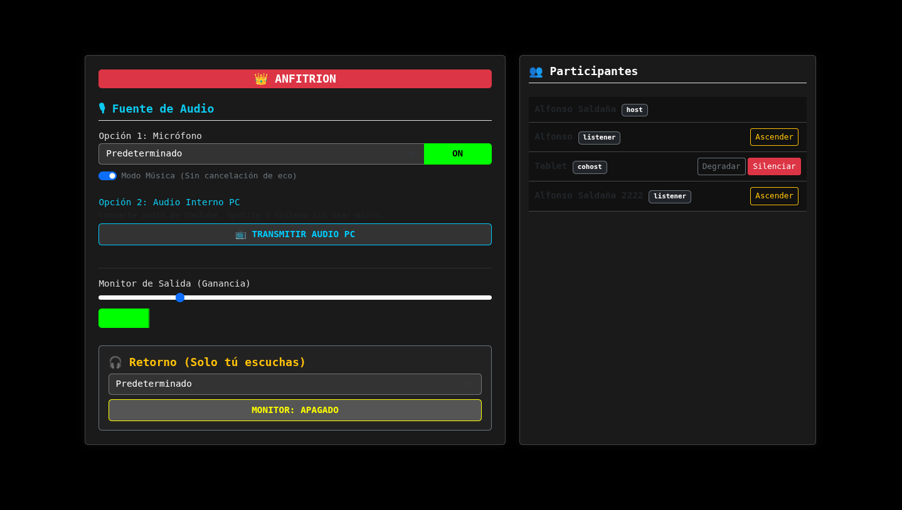
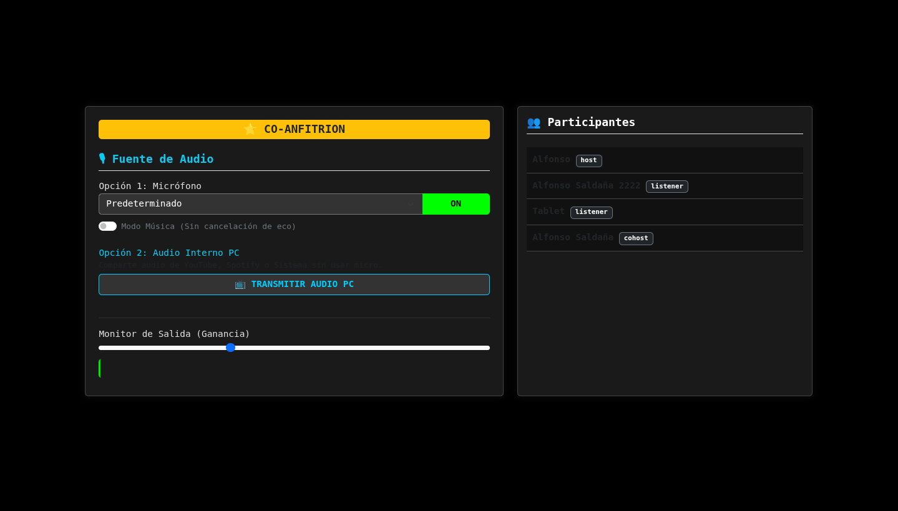
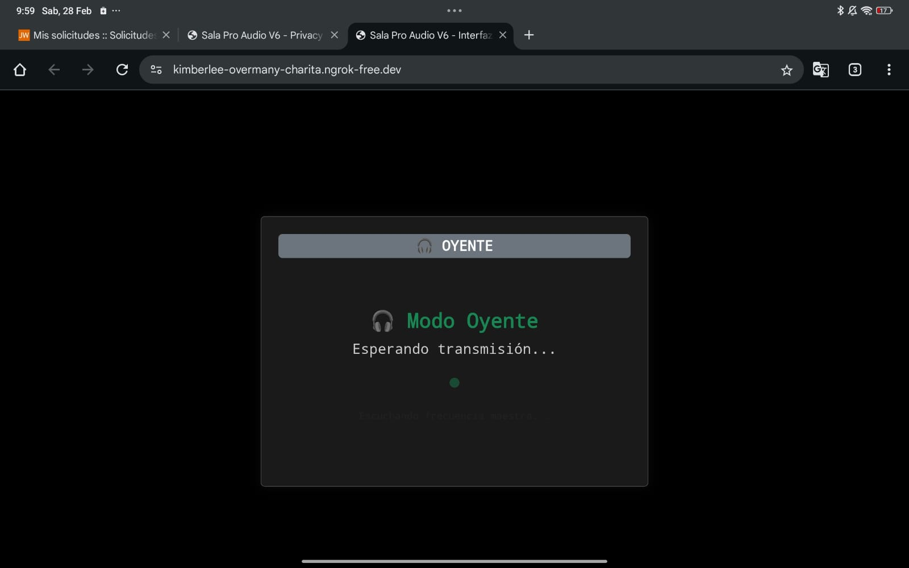

# 🎙️ Audio Conference LAN/WAN

### by F3NR1R


------------------------------------------------------------------------

# \[alfonso@f3nr1r \~\]\$ neofetch

``` text
                   -`                    Alfonso Saldaña Campos (F3NR1R)
                  .o+`                   ----------------------
                 `ooo/                   OS: Arch Linux x86_64
                `+oooo:                  DEGREE: B.S. Computer Science (BUAP)
               `+oooooo:                 GPA: 8.3 / 10.0
               -+oooooo+:                KERNEL: Linux-6.x.x-arch1-1
             `/:-:++oooo+:               SHELL: zsh
            `/++++/+++++++:              SPECIALTY: Networks, Server Administrator & Cybersec
           `/++++++++++++++:             EXPERIENCE: Junior NetAdmin @ ASR-BUAP
          `/+++ooooooooooooo/`           GOAL: Astrophysics & Astro-Data Analysis
         ./ooossssqssoooosssso`
         .oossssso-````/ossssss+          [■■■■■■■■■□□□] 80% Processing Data
        -osssssso.      :ssssssso.
       :osssssss/        ossssoooo.       "The universe is just code waiting
      /ossssssss/        +ssssooo/-        to be refactored."
    `/ossssso+/:-        -:/+osssso+-     "Ad astra per aspera"
   `+sso+:-`                 `.-/+oso:
  `++:.                            `:/+/
  .`                                  `/
```

------------------------------------------------------------------------

# 🎙 Conferencia Audio LAN/WAN

Sistema de audio conferencia simple, robusto y de baja latencia diseñado
para redes locales (LAN) o transmisión vía Internet (WAN). Utiliza
**WebRTC** para comunicación Peer-to-Peer y **Socket.io** para la
señalización.

------------------------------------------------------------------------

## 🔥 Características

### Arquitectura WebRTC Mesh

Audio directo entre clientes (P2P) para mínima latencia.

### Gestión de Roles

-   👑 **Host**: Control total, puede silenciar, ascender o degradar
    usuarios.
-   ⭐ **Co-Host**: Puede transmitir audio y hablar.
-   🎧 **Listener**: Solo escucha (modo privacidad activo: no ve la
    lista de usuarios).

### Transmisión de Audio de Sistema

Capacidad para transmitir audio de alta fidelidad desde el PC (YouTube,
Spotify, DAWs) sin usar micrófono.

### Interfaz Reactiva

-   Vúmetros en tiempo real\
-   Monitoreo local\
-   Diseño de alto contraste

### Sanitización & Seguridad

-   Protección básica contra XSS\
-   Limpieza automática de recursos (Garbage Collection) al desconectar
    usuarios

------------------------------------------------------------------------

## 🛠 Prerrequisitos

Necesitas tener instalado **Node.js**.

### 1.- Instalar Node.js

**Arch Linux**

``` bash
sudo pacman -S nodejs npm
```

**Debian/Ubuntu**

``` bash
sudo apt install nodejs npm
```

**Windows/Mac** Descargar instalador desde: https://nodejs.org

------------------------------------------------------------------------

## 🚀 Instalación y Despliegue

### 1.- Clonar el repositorio

``` bash
git clone https://github.com/AlfonsoSaldanaCampos/Audio-Conference.git
cd Audio-Conference
```

### 2.- Instalar dependencias

``` bash
npm install
```

### 3.- Iniciar el Servidor

``` bash
npm start
# O alternativamente:
node server.js
```

Verás:

    Servidor corriendo en http://localhost:3000

------------------------------------------------------------------------

## 📡 Cómo Conectarse

### 🏠 Opción A: Red Local (LAN)

#### Encontrar tu IP Local

**Linux/Mac**

``` bash
ip a
# o
ifconfig
```

**Windows**

``` bash
ipconfig
```

Busca una IP tipo:

    192.168.x.x
    10.x.x.x

#### Compartir URL

    http://<TU_IP_LOCAL>:3000

Ejemplo:

    http://192.168.1.15:3000

⚠ **Nota Importante sobre LAN**

Los navegadores modernos bloquean el acceso al micrófono en conexiones
NO seguras (HTTP) que no sean `localhost`.

Si el micrófono no funciona en LAN: - Usa la opción WAN con ngrok - O
habilita flags del navegador para permitir orígenes inseguros

------------------------------------------------------------------------

### 🌐 Opción B: Internet (WAN) con ngrok (Recomendado)

1.- Instala **ngrok**

2.- Con el servidor corriendo:

``` bash
ngrok http 3000
```

3.- Copia la dirección que dice:

    Forwarding https://xxxxx.ngrok-free.app

4.- Comparte ese link

Al ser HTTPS, el micrófono funcionará sin problemas.

------------------------------------------------------------------------

## ⚙ Uso del Sistema

### 🔐 Login

Ingresa un nombre de usuario.

### 👥 Roles

-   El primero en entrar se convierte automáticamente en **Host**
-   Los siguientes entran como **Oyentes**

<p align="center">
  
</p>

<p align="center">
  
</p>

<p align="center">
  
</p>

### 🎛 Controles

-   🎙 **ON/OFF** → Activar o desactivar micrófono
-   📺 **TRANSMITIR AUDIO PC** → Compartir audio del sistema
    (Chrome/Edge/Brave)
-   🔊 **Monitor** → Escucharte a ti mismo (loopback)

------------------------------------------------------------------------

## 🧠 Tecnologías

**Backend** - Node.js - Express

**Real-Time** - Socket.io (WebSockets)

**Media** - WebRTC (RTCPeerConnection, getUserMedia, getDisplayMedia)

**Frontend** - HTML5 - Bootstrap 5 - Vanilla JavaScript

------------------------------------------------------------------------


> "Ad astra per aspera"

**Developed by F3NR1R**
